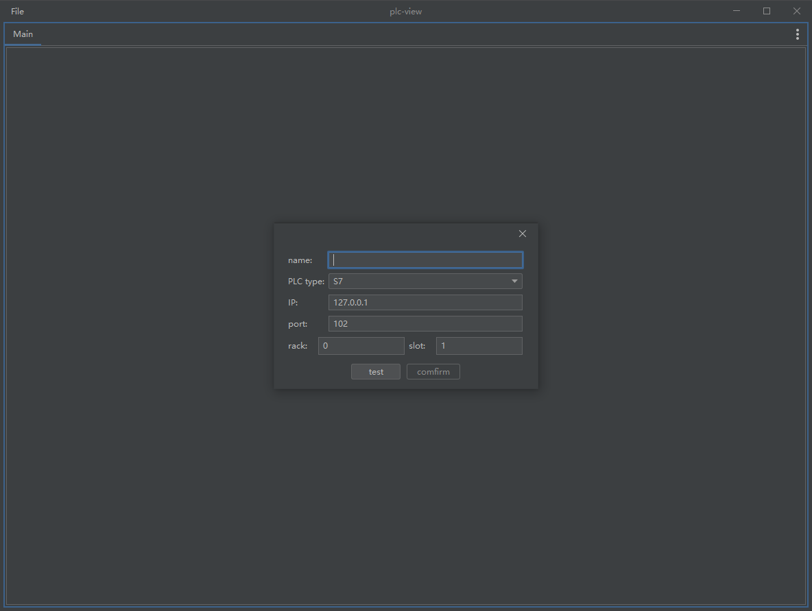
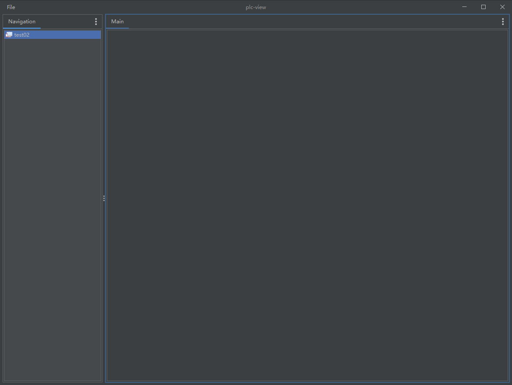
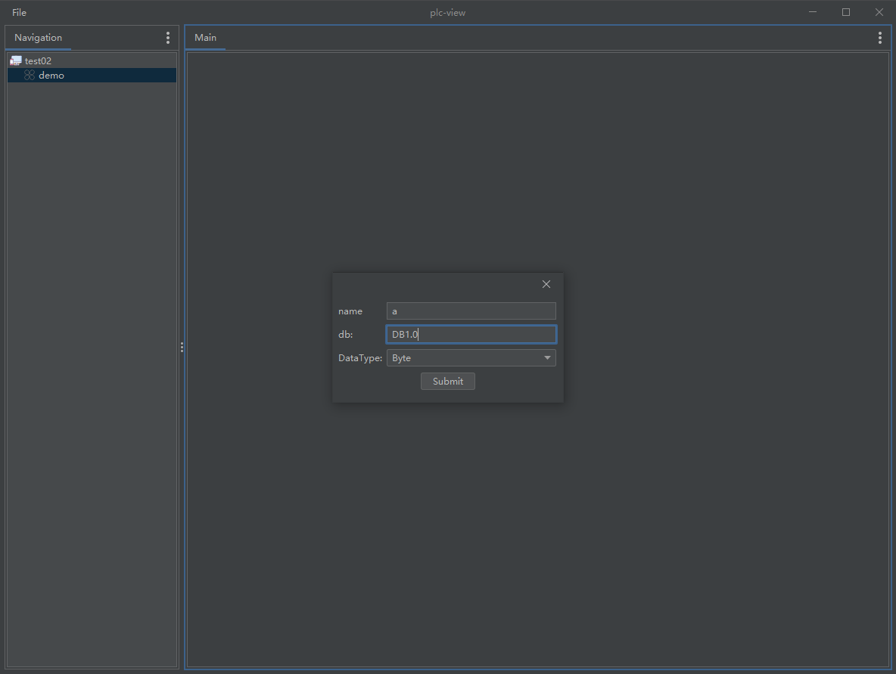

# plc-view
This is a plc device view,You can use this project to understand the point data of PLC equipment

## Build and Run
Java Version: 17
> git clone https://github.com/123enjoy/plc-view.git
> .\gradlew jar  
> java -jar build/libs/plc-view.jar

## Use
Run the project
1. new workspace
    create a new workspace,your can config the method of connect. 

2. open workspace
    your can open the workspace,then you can see the point data of plc equipment.

3. config point or add group
    

4. your can see the point data of plc equipment.

## TODO
1. Support More method of connect
2. Support View Group

